# SITTS System Behavior Flowchart

This diagram maps how `city-ongs` (SITTS) behaves end-to-end: tenant bootstrap and per-request scoping in `accounts`, the `contracts` lifecycle from creation through execution, monthly `accountability` (expenses/revenues, reconciliation against `bank` statements), the `audesp` Fase V compliance pipeline that assembles and submits TCESP JSON payloads, the public `transparency_portal`, on-demand `reports` PDF exports, and the cross-cutting `activity` log/notification engine plus the `dashboard`. Solid arrows are steps within one area; thick arrows are the important hand-offs *between* areas (e.g. Contract execution → Accountability → AUDESP → TCESP); dotted arrows mark softer/read-only references or known gaps. Diamonds are decision points, double-bracket nodes are terminal states or external systems.

Generated by a multi-agent research pass (5 areas mapped independently, then synthesized) on 2026-07-11. Two details the original research flagged as gaps have since been resolved and are corrected here: the Phase 5 API client (`audesp/clients.py`, `services.py`, `secrets.py`, `AudespCredential`) merged to `main` shortly after this research ran, and `build_parecer_conclusivo`'s missing-`ConclusiveOpinion` crash was already fixed in that same merge.

```mermaid
flowchart TD

%% ================= TENANCY BOOTSTRAP & REQUEST SCOPING (accounts) =================
subgraph BOOT["Tenancy Bootstrap & Request Scoping (accounts)"]
  BOOT_CH[Create CityHall]
  BOOT_ORG[Create Organization tenant]
  BOOT_AREA["Create Area (pasta gestora)"]
  BOOT_USER[Create first Master/Civil Servant user]
  BOOT_NOUI[["No self-service UI - Django admin / seed_dev only"]]
  BOOT_REQ[Incoming HTTP request]
  BOOT_AUTH{User authenticated?}
  BOOT_STAFFPATH{"Superuser on /__staff__/ ?"}
  BOOT_TEN_OFF[["Tenant context disabled - unfiltered queries"]]
  BOOT_TEN_ON[["Tenant context = user.organization"]]

  BOOT_CH --> BOOT_ORG --> BOOT_AREA --> BOOT_USER
  BOOT_USER -.-> BOOT_NOUI
  BOOT_REQ --> BOOT_AUTH
  BOOT_AUTH -->|No| BOOT_TEN_OFF
  BOOT_AUTH -->|Yes| BOOT_STAFFPATH
  BOOT_STAFFPATH -->|Yes| BOOT_TEN_OFF
  BOOT_STAFFPATH -->|No| BOOT_TEN_ON
end

%% ================= STAFF ACCOUNTS, DOCS & NOTIFICATIONS UI (accounts) =================
subgraph ACCT["Staff Accounts, Documents & Notifications UI (accounts)"]
  ACCT_NEW["Admin creates Folder Manager / Accountant / Committee member"]
  ACCT_GUARD{"can_add_new_* permission?"}
  ACCT_DENY[["Blocked"]]
  ACCT_CREATEUSER[Generate password, create User, assign areas]
  ACCT_EDIT[Edit or toggle active status]
  ACCT_DOC[Upload Organization Document]
  ACCT_DOCPUB{is_public?}
  ACCT_BELL[User opens notification bell]
  ACCT_UNREAD[Fetch unread notifications JSON]
  ACCT_CLICK[Click a notification]
  ACCT_READMARK[Mark read_at, redirect by category]
  ACCT_CATCHK{Category mapped to a detail route?}
  ACCT_HOME[["Redirect home - fallback / gap"]]

  ACCT_NEW --> ACCT_GUARD
  ACCT_GUARD -->|No| ACCT_DENY
  ACCT_GUARD -->|Yes| ACCT_CREATEUSER
  ACCT_CREATEUSER -.-> ACCT_EDIT
  ACCT_DOC --> ACCT_DOCPUB
  ACCT_BELL --> ACCT_UNREAD --> ACCT_CLICK --> ACCT_READMARK --> ACCT_CATCHK
end

%% ================= CONTRACT LIFECYCLE (contracts) =================
subgraph CT["Contract Lifecycle (contracts)"]
  CT_NEW["Create Contract (ajuste)"]
  CT_VALCHK{total = municipal + counterpart?}
  CT_PLANNING[["Status: PLANNING"]]
  CT_GATEPLAN{is_on_planning?}
  CT_GOALS[Plan Goals & Steps]
  CT_ITEMS["Plan Budget Items (rubricas)"]
  CT_REALLOC[Request item value reallocation]
  CT_REALLOCCHK{Reallocation approved?}
  CT_ADDENDUM["Record Addendum (aditivo)"]
  CT_TIMELINE[Define monthly transfer timeline]
  CT_TIMELINECHK{Sums match contract totals?}
  CT_BANKLINK[Link checking/investing Bank Account]
  CT_TOEXEC[["Status: EXECUTION"]]
  CT_GATEEXEC{is_on_execution?}
  CT_EXECRPT["Monthly execution report (WIP to SENT to CORRECTING/FINISHED)"]
  CT_TOFINISH[["Status: FINISHED"]]
  CT_INTERESTED["Add interested party (not status-gated)"]
  CT_COMPANY["Manage Company party (not status-gated)"]
  CT_PURCHASE[Track item purchase / supplementation]
  CT_DETAIL[Contract detail page]

  CT_NEW --> CT_VALCHK
  CT_VALCHK -->|Yes| CT_PLANNING --> CT_GATEPLAN
  CT_GATEPLAN -->|Yes| CT_GOALS
  CT_GATEPLAN -->|Yes| CT_ITEMS
  CT_GATEPLAN -->|Yes| CT_ADDENDUM
  CT_GATEPLAN -->|Yes| CT_TIMELINE --> CT_TIMELINECHK
  CT_GATEPLAN -->|Yes| CT_BANKLINK
  CT_ITEMS --> CT_REALLOC --> CT_REALLOCCHK
  CT_ITEMS --> CT_PURCHASE
  CT_PLANNING --> CT_TOEXEC --> CT_GATEEXEC
  CT_GATEEXEC -->|Yes| CT_EXECRPT --> CT_TOFINISH
  CT_NEW -.-> CT_INTERESTED
  CT_NEW -.-> CT_COMPANY
  CT_NEW -.-> CT_DETAIL
end

%% ================= BANK RECONCILIATION (bank) =================
subgraph BK["Bank Statement Ingestion (bank)"]
  BK_OFX[Upload OFX file]
  BK_PARSE["Preview parse (no persistence)"]
  BK_DUPCHK{Statement exists for exact date?}
  BK_IMPORT[["Create BankStatement + Transactions"]]
  BK_MANUAL[Manual statement + transaction entry]
  BK_MANUALCHK{Statement exists this month?}
  BK_VIEW[Bank statement view - running balance]
  BK_EXPORT[["Export synthetic OFX"]]

  BK_OFX --> BK_PARSE --> BK_DUPCHK
  BK_DUPCHK -->|No| BK_IMPORT
  BK_MANUAL --> BK_MANUALCHK
  BK_MANUALCHK -->|No| BK_IMPORT
  BK_IMPORT --> BK_VIEW --> BK_EXPORT
end

%% ================= MONTHLY ACCOUNTABILITY (accountability) =================
subgraph AB["Monthly Accountability (accountability)"]
  AB_NEW[Create Accountability for month/year]
  AB_DUPCHK{contract+month+year exists?}
  AB_WIP[["Status: WIP"]]
  AB_EXPENSE[Add / edit Expense]
  AB_REVENUE[Add / edit Revenue]
  AB_BUDGETCHK{Within ContractItem budget cap?}
  AB_XLSX[Bulk import via XLSX]
  AB_RECONCILE[Reconcile Expense/Revenue]
  AB_RECONCILECHK{Transaction sum equals value?}
  AB_SEND[Send to analysis]
  AB_SENT[["Status: SENT"]]
  AB_REVIEWDEC{Reviewer decision}
  AB_CORRECTING[["Status: CORRECTING"]]
  AB_FINISHED[["Status: FINISHED"]]
  AB_PENDENCIES[Pendencies rollup]
  AB_DETAIL[Accountability detail page]

  AB_NEW --> AB_DUPCHK
  AB_DUPCHK -->|No| AB_WIP
  AB_WIP --> AB_EXPENSE --> AB_BUDGETCHK
  AB_WIP --> AB_REVENUE
  AB_WIP --> AB_XLSX
  AB_EXPENSE --> AB_RECONCILE
  AB_REVENUE --> AB_RECONCILE
  AB_RECONCILE --> AB_RECONCILECHK
  AB_WIP --> AB_SEND --> AB_SENT --> AB_REVIEWDEC
  AB_REVIEWDEC -->|CORRECTING| AB_CORRECTING --> AB_SEND
  AB_REVIEWDEC -->|FINISHED| AB_FINISHED
  AB_SENT -.-> AB_PENDENCIES
  AB_FINISHED -.-> AB_DETAIL
end

%% ================= AUDESP FASE V COMPLIANCE (audesp) =================
subgraph AUD["AUDESP Fase V Compliance (audesp)"]
  AUD_TRIGGER["build_and_validate(contract, fiscal_year, ajuste_type)"]
  AUD_TENANTCTX[Enter tenant_context organization]
  AUD_ANNUALCHK{AnnualStatement exists?}
  AUD_CRASH[["Uncaught exception - no audit row written"]]
  AUD_ASSEMBLE[Assemble JSON payload via builders]
  AUD_SCHEMACHK{JSON Schema valid?}
  AUD_VALID[["AudespSubmission: VALID"]]
  AUD_INVALID[["AudespSubmission: INVALID"]]
  AUD_SUBMIT[submit VALID submission]
  AUD_CREDCHK{Active AudespCredential?}
  AUD_LOGIN[["Login to TCESP - obtain token"]]
  AUD_POST[["POST payload to TCESP webservice"]]
  AUD_SUBMITTED[["Status: SUBMITTED"]]
  AUD_POLL[check_status polling]
  AUD_STATUSMAP{TCESP status value}
  AUD_ACCEPTED[["Status: ACCEPTED"]]
  AUD_REJECTED[["Status: REJECTED - dead end, no resubmit"]]
  AUD_DRIFT[["Unmapped status - local row drifts silently"]]
  AUD_NEG[["Declaração Negativa builder - not wired into submission flow"]]
  AUD_RETIF[["Retificação - not implemented anywhere"]]
  AUD_CREDMISSING[["No active credential - uncaught DoesNotExist"]]

  AUD_TRIGGER --> AUD_TENANTCTX --> AUD_ANNUALCHK
  AUD_ANNUALCHK -->|No| AUD_CRASH
  AUD_ANNUALCHK -->|Yes| AUD_ASSEMBLE --> AUD_SCHEMACHK
  AUD_SCHEMACHK -->|No errors| AUD_VALID
  AUD_SCHEMACHK -->|Errors| AUD_INVALID
  AUD_VALID --> AUD_SUBMIT --> AUD_CREDCHK
  AUD_CREDCHK -->|No| AUD_CREDMISSING
  AUD_CREDCHK -->|Yes| AUD_LOGIN --> AUD_POST --> AUD_SUBMITTED --> AUD_POLL --> AUD_STATUSMAP
  AUD_STATUSMAP -->|Armazenado| AUD_ACCEPTED
  AUD_STATUSMAP -->|Rejeitado| AUD_REJECTED
  AUD_STATUSMAP -->|"Recebido / Substituído / Excluído"| AUD_DRIFT
  AUD_ASSEMBLE -.->|not wired to services| AUD_NEG
  AUD_REJECTED -.->|no code path resubmits| AUD_RETIF
end

%% ================= PUBLIC TRANSPARENCY PORTAL (transparency_portal) =================
subgraph TP["Public Transparency Portal (transparency_portal)"]
  TP_LIST[Public partnership list]
  TP_PUBCHK{is_public = true?}
  TP_FILTER[Filter by year / org / search]
  TP_DETAIL[["Partnership detail - NOT filtered by is_public"]]
  TP_ORGLIST[Partnerships by organization]
  TP_DOCS[Organization public documents]
  TP_IRREG[["Report irregularity - login required, orphaned link"]]
  TP_CHECKLIST[["TransparencyChecklist - never rendered to citizens"]]

  TP_LIST --> TP_PUBCHK
  TP_PUBCHK -->|Yes| TP_FILTER --> TP_DETAIL
  TP_ORGLIST --> TP_DETAIL
  TP_LIST -.-> TP_ORGLIST
  TP_LIST -.-> TP_DOCS
  TP_DETAIL -.-> TP_IRREG
end

%% ================= REPORT GENERATION (reports) =================
subgraph RPT["Report Generation (reports)"]
  RPT_FORM[Report builder form]
  RPT_SCOPE[Scope contracts by user access]
  RPT_BANKCHK{Contract has bank account?}
  RPT_AJAX[AJAX generate - live preview]
  RPT_PDF[["Export PDF via fpdf2 exporters"]]
  RPT_FALLBACK["Native POST fallback (blind download)"]

  RPT_FORM --> RPT_SCOPE --> RPT_BANKCHK
  RPT_BANKCHK -->|Yes| RPT_AJAX --> RPT_PDF
  RPT_BANKCHK -->|Yes| RPT_FALLBACK --> RPT_PDF
end

%% ================= ACTIVITY LOG, NOTIFICATIONS & DASHBOARD (activity/dashboard) =================
subgraph ACT["Activity Log, Notification Engine & Dashboard (activity/dashboard)"]
  ACT_WRITE[Any tracked write action across apps]
  ACT_LOG[["ActivityLog row created"]]
  ACT_SIGNAL[post_save signal fires]
  ACT_MAPCHK{"Action mapped to a notification builder? (~13/80)"}
  ACT_NOTIF[["Notification row created"]]
  ACT_EMAILSEND[["Email sent via SendGrid"]]
  ACT_DASHLOAD[Dashboard loads with filters]
  ACT_DASHSCOPE[Scope contracts/accountabilities by access]
  ACT_DASHKPI[Aggregate KPIs & monthly chart data]

  ACT_WRITE --> ACT_LOG --> ACT_SIGNAL --> ACT_MAPCHK
  ACT_MAPCHK -->|Yes| ACT_NOTIF --> ACT_EMAILSEND
  ACT_DASHLOAD --> ACT_DASHSCOPE --> ACT_DASHKPI
end

%% ================= EXTERNAL SYSTEMS =================
subgraph EXT["External Systems"]
  EXT_TCESP[["TCESP Webservice"]]
  EXT_SENDGRID[["SendGrid Email"]]
  EXT_SECRETS[["GCP Secret Manager / .env credentials"]]
end

%% ================= CROSS-AREA HAND-OFFS =================
BOOT_USER ==>|first admins can then create staff| ACCT_NEW
BOOT_TEN_ON -.->|scopes every query below| CT_NEW

CT_BANKLINK ==>|contract owns the BankAccount| BK_OFX
CT_BANKLINK ==>|contract owns the BankAccount| BK_MANUAL
CT_GATEEXEC ==>|is_on_execution required| AB_NEW
CT_ITEMS ==>|anual_expense budget cap read| AB_BUDGETCHK
BK_IMPORT ==>|Transactions become reconciliation candidates| AB_RECONCILE

AB_FINISHED ==>|fiscal-year data feeds compliance build| AUD_TRIGGER
CT_GOALS -.->|goal_code, periodicity, AnnualResult| AUD_ASSEMBLE
CT_PURCHASE -.->|Asset, SupplierContract, CertificateReference| AUD_ASSEMBLE
ACCT_CREATEUSER -.->|Employee, CededServant org-scoped data| AUD_ASSEMBLE
TP_CHECKLIST -.->|consumed by builder for AUDESP payload| AUD_ASSEMBLE
AUD_POST ==> EXT_TCESP
AUD_POLL ==> EXT_TCESP
AUD_CREDCHK -.-> EXT_SECRETS

CT_NEW -.->|Contract FK; creation of the mirror row not traced| TP_LIST
AB_FINISHED -.->|accountability status feeds portal detail| TP_DETAIL

CT_NEW -.->|read at export time| RPT_SCOPE
AB_EXPENSE -.->|read at export time| RPT_PDF
BK_VIEW -.->|read at export time| RPT_PDF
CT_ADDENDUM -.->|read at export time| RPT_PDF

ACCT_CREATEUSER ==> ACT_LOG
CT_NEW ==> ACT_LOG
AB_SEND ==> ACT_LOG
BK_IMPORT ==> ACT_LOG
ACT_EMAILSEND ==> EXT_SENDGRID
ACT_NOTIF ==>|badge count / bell list| ACCT_BELL
ACCT_CATCHK -->|Accountability_*| AB_DETAIL
ACCT_CATCHK -->|Contract_*| CT_DETAIL
ACCT_CATCHK -->|Execution_* or unmapped| ACCT_HOME

CT_NEW -.->|scoped read| ACT_DASHSCOPE
AB_NEW -.->|scoped read| ACT_DASHSCOPE
CT_TIMELINE -.->|ContractMonthTransfer sums| ACT_DASHKPI

%% ================= STYLING =================
classDef decision fill:#fff6da,stroke:#b8860b,color:#3a2f00;
classDef gap fill:#fbdede,stroke:#b3261e,color:#3a0a08;

class BOOT_AUTH,BOOT_STAFFPATH,ACCT_GUARD,ACCT_DOCPUB,ACCT_CATCHK,CT_VALCHK,CT_GATEPLAN,CT_REALLOCCHK,CT_TIMELINECHK,CT_GATEEXEC,BK_DUPCHK,BK_MANUALCHK,AB_DUPCHK,AB_BUDGETCHK,AB_RECONCILECHK,AB_REVIEWDEC,AUD_ANNUALCHK,AUD_SCHEMACHK,AUD_CREDCHK,AUD_STATUSMAP,TP_PUBCHK,RPT_BANKCHK,ACT_MAPCHK decision

class AUD_CRASH,AUD_DRIFT,AUD_NEG,AUD_RETIF,AUD_REJECTED,AUD_CREDMISSING,TP_IRREG,TP_CHECKLIST,ACCT_HOME,ACCT_DENY gap
```

## Legend

- **Diamond `{...}`** — a decision point / branch found in the code (permission check, status gate, validation, amount match, etc.).
- **Rectangle `[...]`** — a normal step: a view, form submission, or processing action.
- **Double-bracket `[[...]]`** — a terminal/state marker (e.g. a lifecycle status the row lands in) or a true external system boundary (TCESP, SendGrid, Secret Manager).
- **Thick arrow `==>`** — a major hand-off of control or data from one app's area to another (the backbone: Contract → Accountability → AUDESP → TCESP; writes → Activity Log → Notification → Bell).
- **Dotted arrow `-.->`** — a softer/read-only cross-area reference (data read at report/build time, a field feeding another app's payload) or an intentional/known gap (a dead end, an unwired builder, a missing route).
- **Yellow fill** — decision nodes (redundant with diamond shape, added for scanability).
- **Red fill ("gap")** — a flow this research confirmed is missing, dead, unreachable, or a bug: `AUD_CRASH` (an AnnualStatement that doesn't exist yet crashes the build instead of a clean error), `AUD_DRIFT` (AUDESP's real `Recebido`/`Substituído`/`Excluído` statuses aren't mapped, so the local row silently goes stale), `AUD_NEG`/`AUD_RETIF` (Declaração Negativa and retificação have no orchestration), `AUD_REJECTED` (no resubmit path), `TP_IRREG` (orphaned, unlinked from any template, and its login redirect 404s), `TP_CHECKLIST` (captured but never shown to citizens despite the app being "named for this requirement"), `ACCT_HOME` (unmapped/Execution_* notification categories silently bounce home).

## Caveats (flagged, not resolved, by the research)

1. **No traced flow creates `PartnershipTransparency`/`FinancialTransfer` rows from `Contract`/`Accountability` data.** The portal reads a `Contract` FK and filters on it, but none of the five research passes found a view, signal, or management command that populates these rows — the `CT_NEW -.-> TP_LIST` arrow is a data reference, not a confirmed sync pipeline. This may be an admin-only/manual step not covered by any pass.
2. **`GRANT` (`Concessão`) contracts have no matching AUDESP builder** among the 5 implemented ajuste types — not shown as a distinct node since no pass could confirm what (if anything) is meant to happen for that concession type.
3. **`ContractItemSupplement` has no review/approval view**, unlike the near-identical `ContractItemNewValueRequest` flow — its `IN_REVIEW`/`APPROVED`/`REJECTED` states exist on the model but nothing in the researched views transitions them, so it is drawn only as far as `CT_PURCHASE` (create/update).
4. Two different code paths can flip a staff account's `is_active` (detail-page POST vs. the dedicated toggle view) with different side effects (`deactivated_at` bookkeeping); both are folded into the single `ACCT_EDIT` node for brevity.
5. Bank-side reconciliation is more nuanced than one arrow can show: the single-item forms require the transaction date to equal the due date, while `batch_reconcile_expenses_view` (a fuzzy auto-matcher) does not — both feed the same `AB_RECONCILECHK` decision in this diagram.
